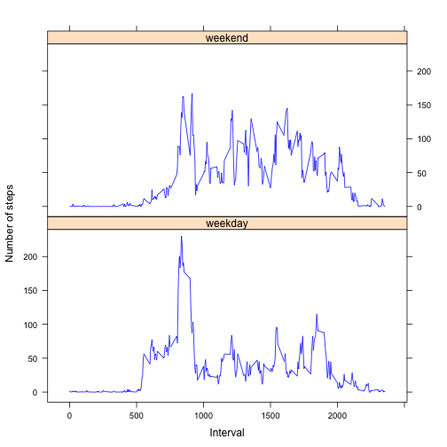

## Loading and preprocessing the data

```r
activity <- read.csv('activity.csv')
```


## What is mean total number of steps taken per day?

```r
totaldailysteps<-tapply(activity$steps,activity$date,sum)
hist(totaldailysteps)
```

 


```r
mean(totaldailysteps,na.rm=TRUE)
```

```
## [1] 10766
```

```r
median(totaldailysteps,na.rm = TRUE)
```

```
## [1] 10765
```

## What is the average daily activity pattern?

```r
activityNoNa <- subset(activity, !is.na(steps))
intervals <- unique(activityNoNa$interval)
meanstepsperinterval<-tapply(activityNoNa$steps,activityNoNa$interval,mean)
plot(intervals,meanstepsperinterval,type="l")
```

 


```r
indexmaximum <- which(meanstepsperinterval==max(meanstepsperinterval),arr.ind = TRUE)[1]
intervalmax <- intervals[indexmaximum]
intervalmax
```

```
## [1] 835
```

## Imputing missing values

```r
TotalNas <- (dim(activity)[1]-dim(activityNoNa)[1])
sum(is.na(activity$steps))
```

```
## [1] 2304
```


```r
#impute missing values with average of interval
#create new data frame with imputed missing values
activity$meanStepsperInterval<-rep(round(meanstepsperinterval),61)
activity$steps[is.na(activity$steps)] <- 
    activity$meanStepsperInterval[is.na(activity$steps)]
newdata <- subset(activity, select = steps:interval)
```


```r
newtotaldailysteps<-tapply(newdata$steps,newdata$date,sum)
hist(newtotaldailysteps)
```

 


```r
mean(newtotaldailysteps,na.rm=TRUE)
```

```
## [1] 10766
```

```r
median(newtotaldailysteps,na.rm = TRUE)
```

```
## [1] 10762
```

## Are there differences in activity patterns between weekdays and weekends?

```r
#create categorical variable
newdata$wday<-weekdays(as.Date(newdata$date))
newdata$wday[newdata$wday=="Sunday" | newdata$wday=="Saturday"]<-"weekend"
newdata$wday[newdata$wday!="weekend"]<-"weekday"
newdata$wday<-as.factor(newdata$wday)
```


```r
require(lattice)
xyplot(steps ~ interval | wday, data = newdata,       
       layout = c(1,2), type = "l", col="blue",
       xlab="Interval", ylab="Number of steps",
       ylim=c(-15,240), 
       panel = function(x, y, ...) {
           panel.average(x, y, ...,horizontal=FALSE)
           })
```

 
